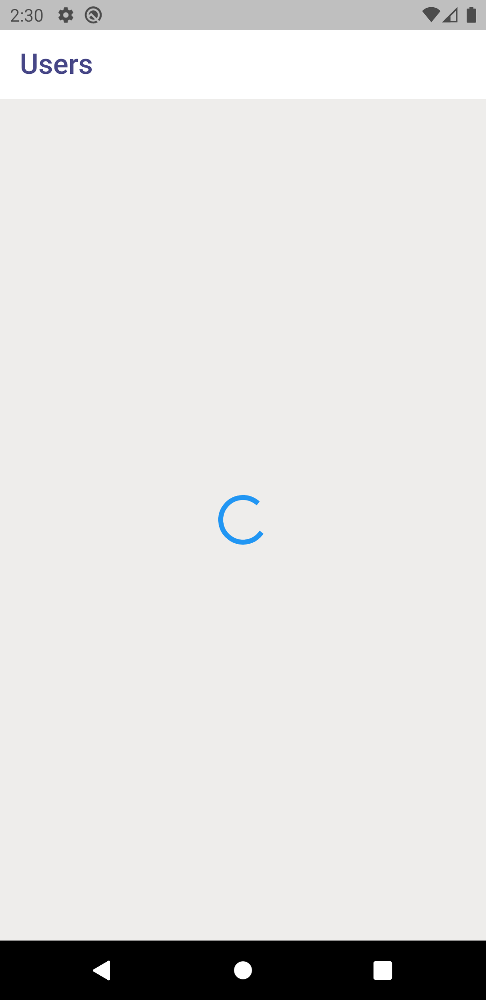
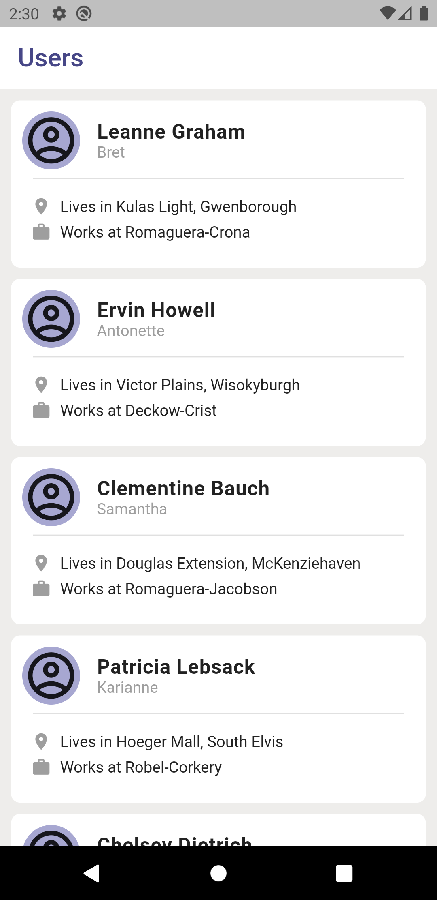
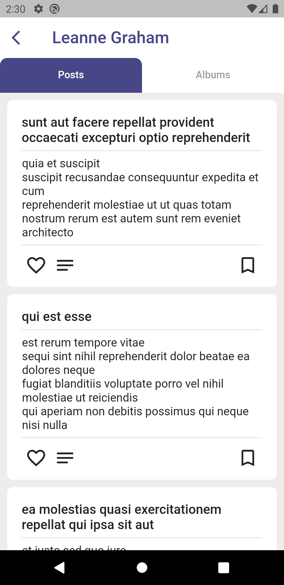
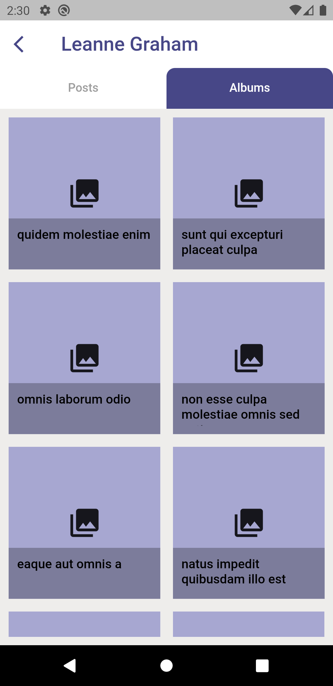

# Flutter fetch Users, Posts and Album using Provider State Management

- PROVIDER package is used for data management in ```providers``` folder.
- I have also used model for decoding the JSON data in ```models``` folder.

### The home page is ```users_list.dart``` which displays all the users.
- I have implemented ```Circular Loading Indicator```




### Tapping in user redirects to new screen
- Posts


- Albums

